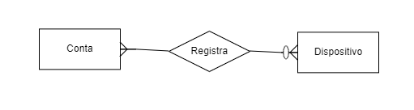
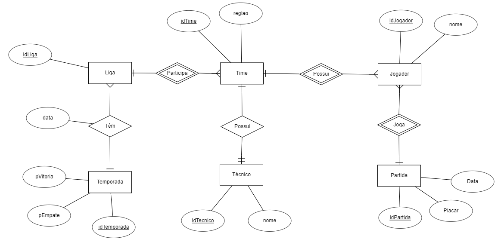
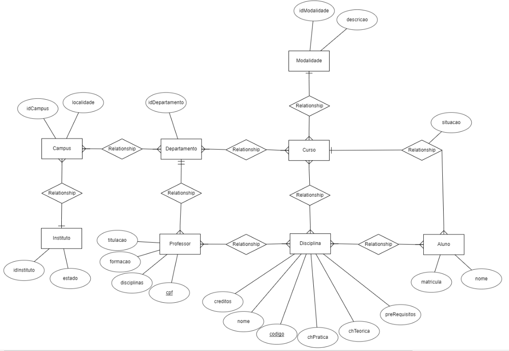

## diagramas ER do [exercicio 1, 2 e 3](exercicio-01.pdf)

### Exercicio 1



### Exercicio 2



### Exercicio 3




## Análise de diagrama ER [exercicio 4](exercicio-01.pdf)

<ol type="a">
  <li>Poderia remover a entidade <strong>Date</strong> e criar atributo no relacionamento <strong>Uses</strong> para representar a data?</li>

  ```
    Nesse caso não. Se remover a entidade, um voo não vai estar relacionado a uma data quando for buscar por algum voo. E também cada par data e aeronove vai ter um voo.
    
  ```
  <li>A seta apontando para a entidade <strong>Aircraft Type</strong>  indica o quê?</li>
  
  ```
    Que cada aeronave pode ter apenas de um tipo.
  ```
  <li>Por qual motivo não poderia ter uma seta partindo do relacionamento <strong>Is Certified</strong> para a entidade
<strong>Aircraft Type</strong>?</li>
  
  ```
    Porque o funcionário pode ser certificado para mais de um tipo de aeronave.
  ```
  <li>Por que a linha da entidade <strong>Airplane</strong> para o relacionamento <strong>Aircraft Type</strong> é mais espessa (relacionamento identificador)?</li>
    
  ```
    Porque é desejado saber a data e o id da aeronave quando for buscar por algum voo. Cada par Data e avião, vai ter um voo.
  ```
  <li>Por que a linha da entidade <strong>Employee</strong> para o relacionamento <strong>Is Certified</strong> não é espessa (relacionamento identificador)?</li>

  ```
    Porque é um relacionamento de muitos para muitos, não tem como ter um relacionamento identificador(um-para-muitos)
  ```
</ol>
  
