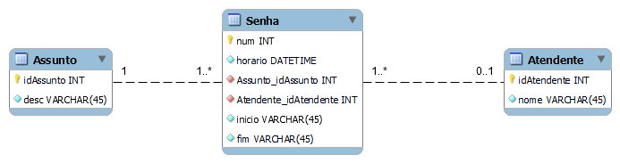
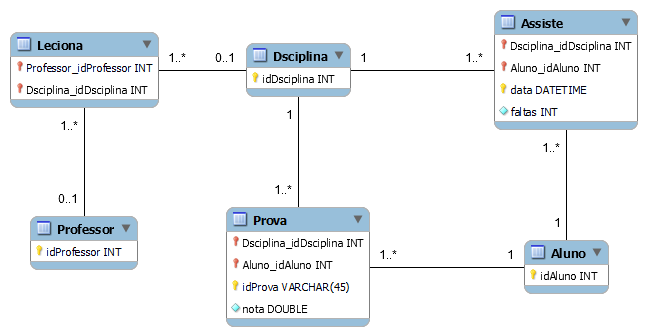
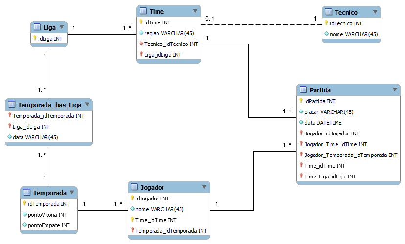
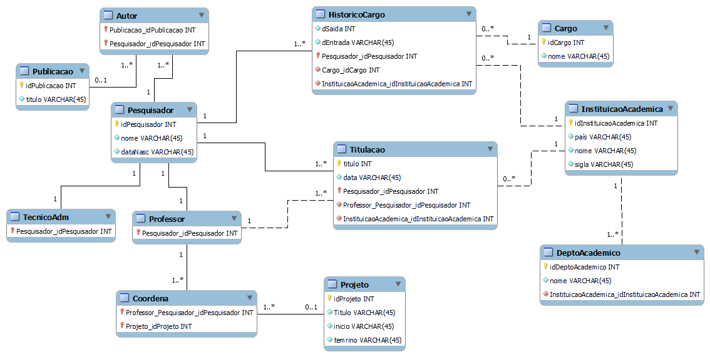
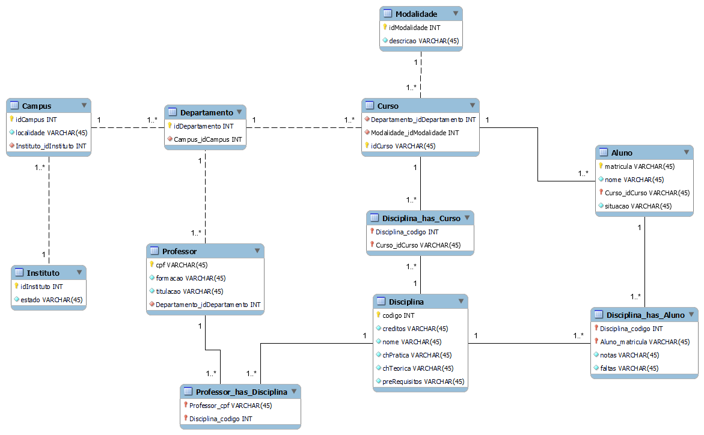

## Resolução da [lista-02](bcd-lista-02-relacional.pdf).

### Questão 1



### Questão 2

```SQL
DROP TABLE IF EXISTS `Empregado` ;
DROP TABLE IF EXISTS `Dependente` ;

create table Empregado
(
    idEmpregado INTEGER not null
        constraint Empregado_pk
        Primary key autoincrement,
    nome        TEXT    not null
);

create table Dependente
(
    idDependente INTEGER not null
        constraint Dependente_pk
        primary key autoincrement,
    nome         TEXT    not null, 
    empregado_idEmpregado INTEGER not null,
  	FOREIGN KEY (empregado_idEmpregado) REFERENCES Empregado(idmpregado)
);

```

### Questão 3



### Questão 4



### Questão 5



### Questão 6

