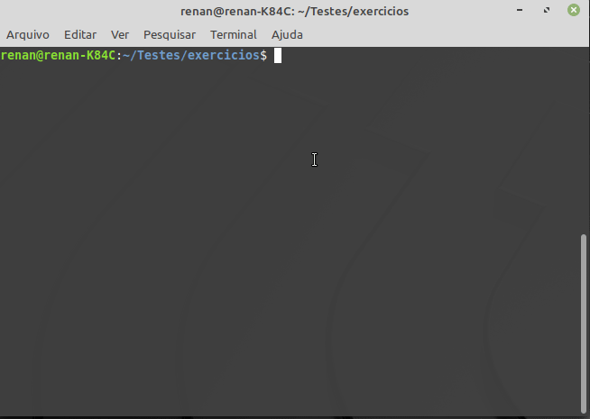
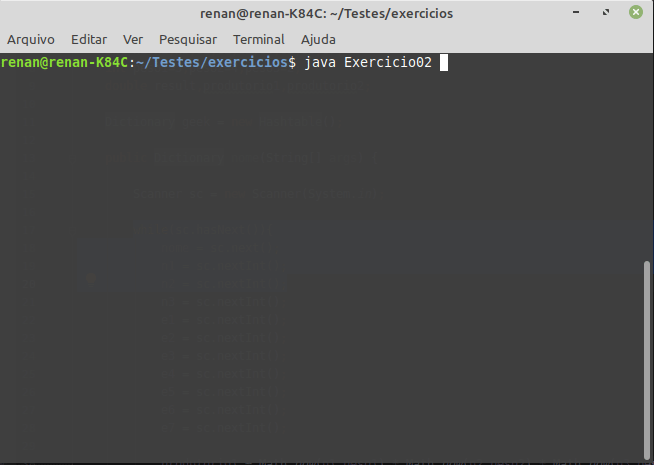
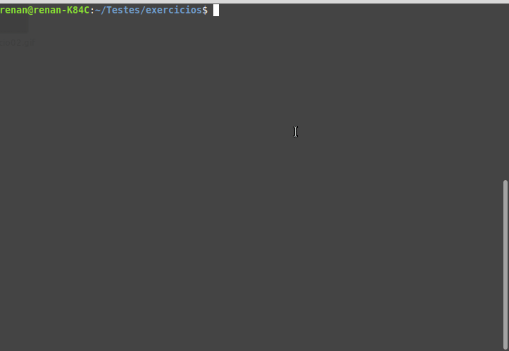

# 1. Conceitos

+ ## Exercício 1
    No diretório projeto eu tenho os seguintes arquivos regulares e diretórios:
    ```shell
     |-- OlaMundo.java
     |-- poo
     |  `-- Segundo.java
    ```
    Considerando que estará dentro do diretório projeto, apresente os comandos para compilar e executar cada uma das classes Java listadas acima.

    <br>     

    __Resposta__
    Para compilar e executar a classe OlaMundo dentro do diretório projeto foi utilizado respectivamente os seguintes comandos  
    ```Shell
        javac OlaMundo.java
        java OlaMundo
    ```
    Para compilar e executar a classe Segundo dentro do diretório poo foi utilizado respectivamente os seguintes comandos além de importar package poo.    
    ```shell
        javac poo/Segundo.java
        java poo.Segundo
    ```
+ ## Exercício 2
    Faça um clone do repositório https://github.com/poo29004/projeto-java-gradle e siga as instruções disponíveis para criar um projeto gradle por meio de linha de comando. Copie o conteúdo do arquivo ‘build.gradle‘ que fora gerado para dentro do arquivo /lista02/Readme.md. Atenção, faça o clone em um diretório fora do diretório onde está resolvendo essa lista de exercício.
    
    <br>

    __Resposta__
    ```Java
    /*
    * This file was generated by the Gradle 'init' task.
    *
    * This generated file contains a sample Java project to get you started.
    * For more details take a look at the Java Quickstart chapter in the Gradle
    * User Manual available at https://docs.gradle.org/6.0.1/userguide/tutorial_java_projects.html
    */

    plugins {
        // Apply the java plugin to add support for Java
        id 'java'

        // Apply the application plugin to add support for building a CLI application.
        id 'application'
    }

    repositories {
        // Use jcenter for resolving dependencies.
        // You can declare any Maven/Ivy/file repository here.
        jcenter()
    }

    dependencies {
        // This dependency is used by the application.
        implementation 'com.google.guava:guava:28.0-jre'

        // Use JUnit test framework
        testImplementation 'junit:junit:4.12'
    }

    application {
        // Define the main class for the application.
        mainClassName = 'engtelecom.poo.App'
    }
    ```


# 2. Prática

+ ## Exercício 1
    [Exercicio 01](Exercicio01.java) - Resolução do primeiro exercício
    
+ ## Exercício 2
    [Exercicio 02](Exercicio02.java) - Resolução do Segundo exercício
    
+ ## Exercício 3
    [Exercicio 03](Exercicio03.java) - Resolução do Terceiro exercício
    
