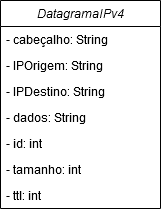

## Livro

> Sistema que contém informações de um determinado livro, como por exemplo: o ano que foi publicado, o autor, número de cópias que foi vendido, quantos volumes o livro possui e qual a editora que publicou.

## Disciplina

> Cadastrar uma nova disciplina onde ela deverá ter um professor, uma certa quantidade de alunos, uma carga horária semestral, se possui algum requisito e cadastrar a sua ementa.

## Curso

> Um curso que pode ter um nome, pode ter uma duracao em horas, uma quantidade de alunos, um local onde será ministado o curso, também pode ter uma nota fornecida pelo Mec.

 

## Robô explorador de planetas

> Robo pode ter uma missão, um planeta para ser explorado, o tempo que deverá ficar em exploração, o tipo de dados que deverá ser coletado e o custo que a missão vai ter.

## Datagrama IPv4

> DatagramaIPv4 pode ter um valor no cabeçalho, um IP de origem e destino, dados que será transportado, uma id de identificação de sequência, um tamanho em bytes e o tempo de vida em milisegundos.

