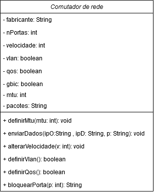

## Impressora

### Características:

Comutador de rede possui um fabricante, uma quantidade de portas que podem ser utilizadas, uma velocidade de operação em Mbps. O comutador pode ou não operar com Vlan,Qos e também pode ou não ter módulo Gbic para uso de fibra ótica além de operar com fragmentação de pacotes.

### Comportamentos:

O Comutador pode definir o tamanho do maior pacote(mtu) que poderá ser transmitido.Pode enviar um pacote do IP de origem para o IP de destino. Também é possível alterar a velocidade de transmissão em Mbps. O comutador pode definir se vai ou não usar Vlan e retorna um boolean informando o status atual, da mesma forma pode definir se vai usar Qos ou não. O switch também pode bloquear uma porta para não ser utilizada por nenhum equipamento.

