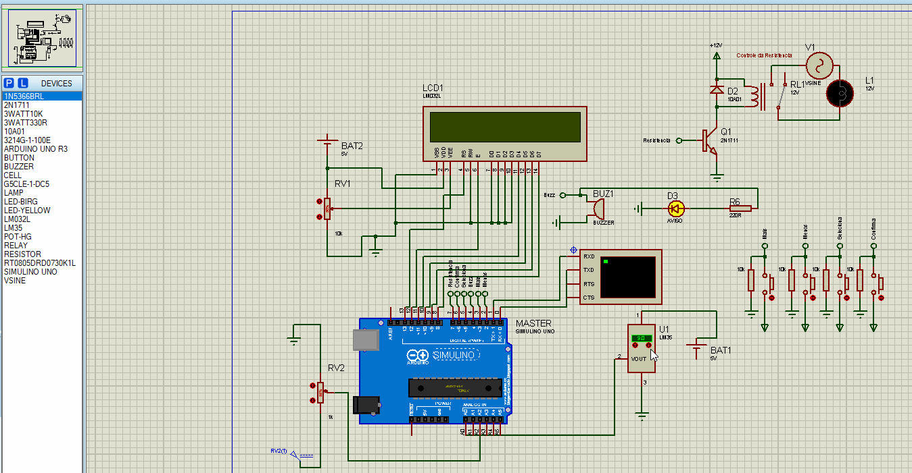

# O objetivo deste laboratório é desenvolver um projeto eletrônico e um programa embarcado para controle de uma receita. Esta pode ser de uma cervejaria artesanal, por exemplo.

> Ainda vou descrever o funcionamento.

+ ## Execução/demonstração da parte automática 
    

+ ## Execução/demonstração da parte manual
    

